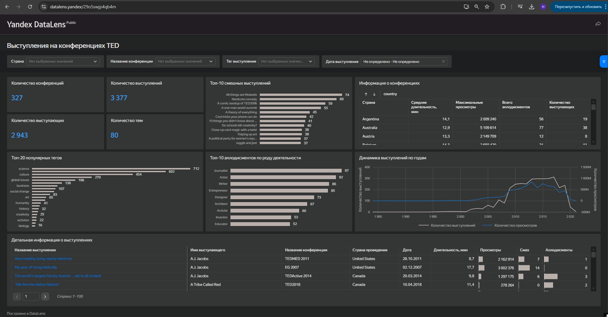

# Анализ конференций TED

## О проекте
Заказчик купил лицензию на проведение классических конференций TED в России. Нужен был инструмент, который поможет спланировать первое мероприятие на основе исторического опыта TED.

**Цель дашборда:** определить оптимальный хронометраж, самые востребованные темы и профили спикеров, которые вызывают максимальный отклик аудитории.

## Данные
Открытая база TED из трёх связанных таблиц:
- `events` — конференции (география, названия)
- `speakers` — профили выступающих
- `talks` — выступления (просмотры, длительность, теги, смех, аплодисменты)

## Стек
- Yandex DataLens

## Дашборд
[Открыть дашборд](https://datalens.yandex/29o5swjp4qb4m)

## Что есть на дашборде

**Общие KPI**
- Количество конференций, выступлений, уникальных спикеров и тем.

**Контент**
- Топ-20 популярных тегов.
- Рейтинг самых смешных выступлений по реакции зала.

**Портрет спикера**
- Аплодисменты в разрезе профессий (журналисты, артисты, писатели и т.д.).

**Организационные метрики**
- Средняя длительность выступлений по странам.
- Максимумы просмотров и количество выступающих.

**Интерактивность**
- Фильтры по стране, названию конференции, тегу и дате.
- Детальная таблица по каждому выступлению.

## Структура репозитория
- `dashboard.png` - скриншот дашборда

## Как запустить
Откройте дашборд по ссылке выше.
